# 목차
-  - - 
## 1. 설치 및 환경 세팅
## 2. 파이썬 기본 문법
## 3. 판다스 설치 및 활용 예제
## 4. 프로젝트 문제 해결 방안 
## 5. 기초 데이터 제공 및 테스트 

- - - 
## 1. 설치 및 환경 세팅 
 - python 3.8.10 버전 설치 
 - 파이참(에디터) 설치 
 - 가상 환경 설정

### 1.1 python 설치 
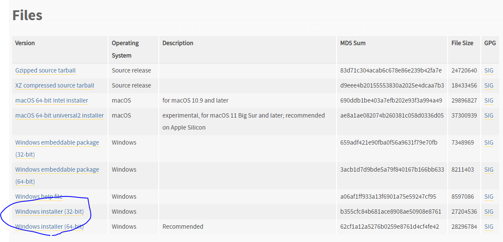
- 공식 홈페이지 python 3.8.10 설치 파일 다운로드 

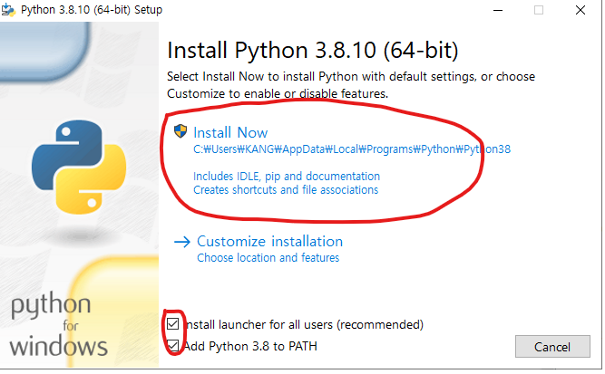
- 체크 박스 선택 후 install Now 클릭 

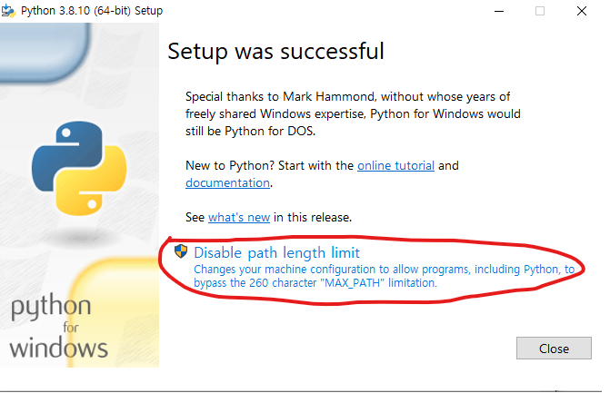
- 설치 완료 

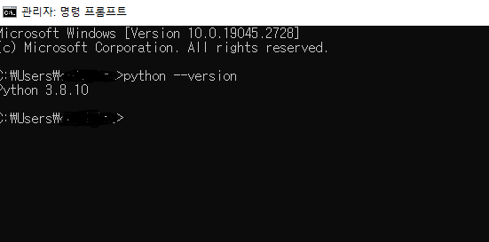
- 설치 확인

### 1.2 에디터 설치 
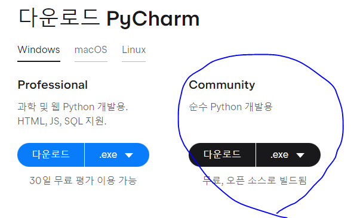
- pycharm Community 다운로드 

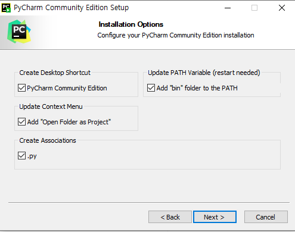
- 항목 체크 후 설치 완료

### 1.3 가상 환경 설정 
- 상단 메뉴의  File > settings...

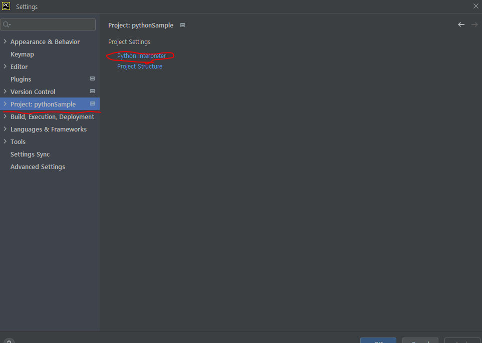
- 해당 프로젝트의 python Interpreter 설정

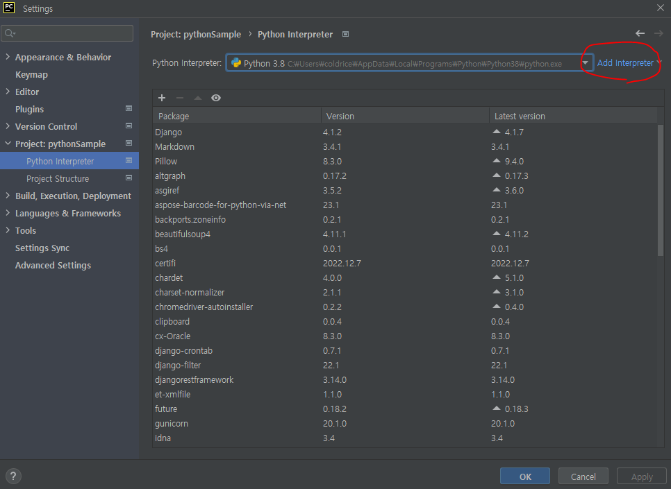
- Interpreter 추가

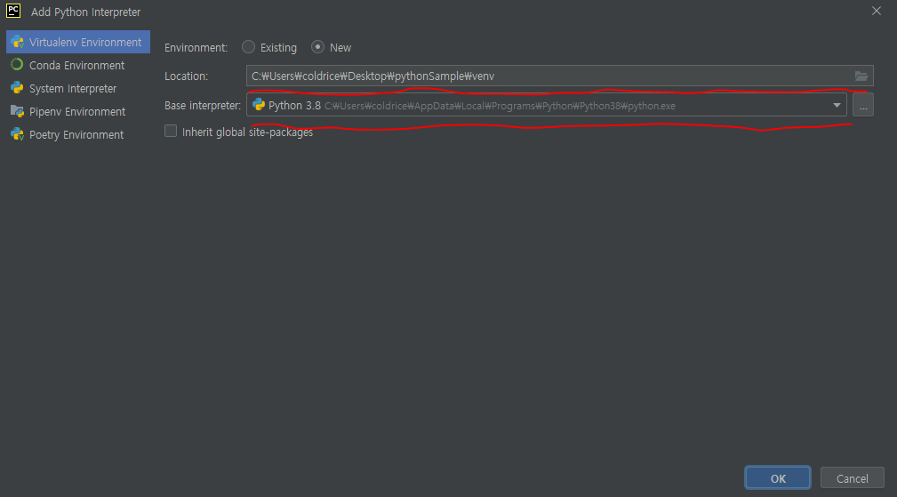
- 가상 환경 위치 설정 및 python 설치 파일 경로 확인 

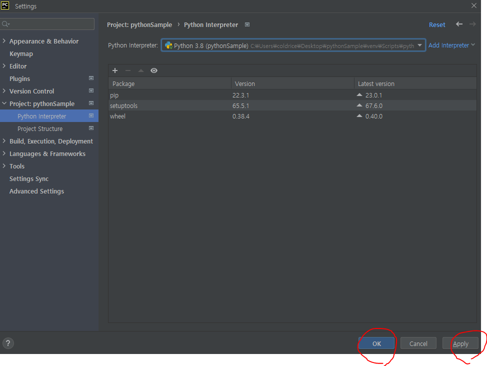
- 적용 후 OK

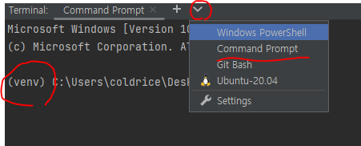
- 하단 Terminal에 Command 탭 추가 후 가상 환경 활성 확인 
- pip list > pip upgrade 
- python.exe -m pip install --upgrade pip